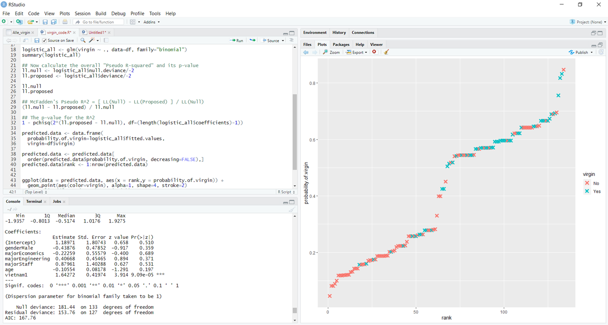

# Predicting-the-Virginity-of-students-with-Logistic-Regression

I tried to predict the Virginity of students from Vietnam/Germany based on a few factors and 
with logistic Regression 

I didn't have the time to create a big database

In the .csv the "Vietnam" column just says, if the student if either from vietnam ( =1) or from Germany (=0) 

It is really basic and the values are not really good, because i didn't have a lot of time for it, but you can maybe
create or find a bigger database with more factors and upgrade the algorithm 

The p-value for the R^2 = 1 - pchisq(2*(ll.proposed - ll.null) df=(length(logistic_all$coefficients)-1)) = 0.0001077374

McFadden's Pseudo R^2 = [ LL(Null) - LL(Proposed) ] / LL(Null) = 0.1525795

